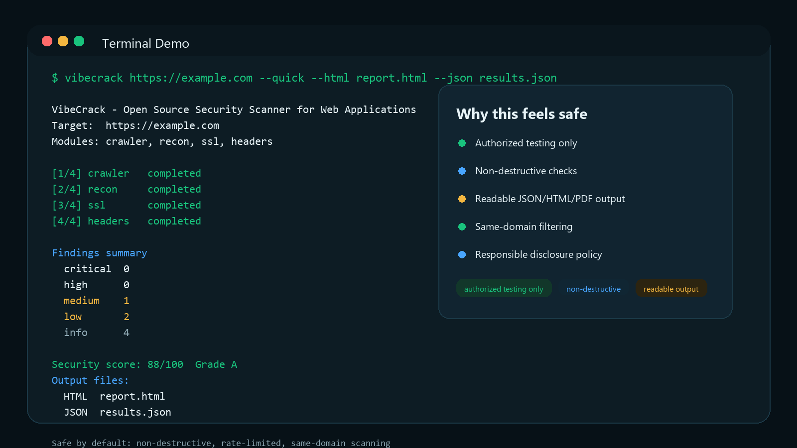
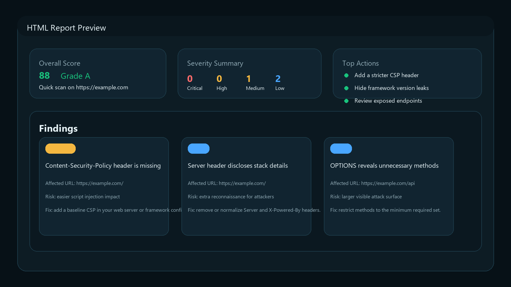

# VibeCrack

[](https://github.com/bentoplebstguida/VibeCrack/actions/workflows/ci.yml)
[](https://pypi.org/project/vibecrack/)
[](https://pypi.org/project/vibecrack/)
[](LICENSE)
[](SECURITY.md)

Open source security scanner for web applications. Built by a vibe coder, for vibe coders, when the vibe is "maybe I should check if this thing is on fire."

Run one command against a site you own and get a clear security snapshot in seconds. Or, in other words: from vibe coder to vibe coder, `vibecrack` helps you vibe check your app before the internet does.

<p align="center">
  
</p>

## Why People Trust It

- **Safe by default**: rate limiting, same-domain filtering, and non-destructive checks
- **Simple to audit**: plain Python package, readable output, no mandatory cloud account
- **Responsible disclosure policy**: documented in [SECURITY.md](SECURITY.md)
- **Contributor guidelines**: documented in [CONTRIBUTING.md](CONTRIBUTING.md)
- **CI on every push**: basic install and import checks run in GitHub Actions

## Who It Is For

VibeCrack is built for developers, founders, and operators who want a practical first security check without needing a full security team.

If you have ever shipped something with the internal monologue "looks fine, probably secure," this project is for you.

It is **not** a replacement for a manual penetration test, secure code review, or a full application security program.

## Quick Start

```bash
pip install vibecrack
vibecrack https://your-site.com
```

That's it. No accounts, no config files, no Docker, and no need to pretend you were definitely going to do the security review later.

## Preview

<p align="center">
  
</p>

Repository social preview asset for GitHub settings:
[`docs/assets/social-preview.png`](docs/assets/social-preview.png)

## Responsible Use

Use VibeCrack only against systems you own or have explicit authorization to test.

- It is designed for **authorized** defensive testing
- It is designed to avoid destructive actions
- It should not be used for unauthorized scanning, denial of service, or data modification

Read the full policy in [SECURITY.md](SECURITY.md).

## What It Scans

VibeCrack runs 15 security scanners against your target:

| Scanner | What it checks |
|---------|---------------|
| **Crawler** | Discovers pages, forms, parameters, JS files, API endpoints |
| **Recon** | Technology detection, HTTP methods, cookies |
| **Subdomains** | DNS brute-force + Certificate Transparency logs |
| **SSL/TLS** | Certificate validity, TLS versions, HTTPS redirect |
| **Headers** | HSTS, CSP, X-Frame-Options, and other security headers |
| **Secrets** | API keys, tokens, credentials exposed in JavaScript |
| **Directories** | Sensitive files (.env, .git, admin panels) |
| **XSS** | Reflected cross-site scripting in forms and URL params |
| **SQLi** | Error-based, blind boolean, and time-based SQL injection |
| **CSRF** | Missing CSRF token protection |
| **SSRF** | Server-side request forgery with OAST |
| **Endpoints** | API discovery and authentication testing |
| **Access Control** | BOLA, BFLA, and IDOR vulnerabilities |
| **XSS Browser** | Confirmed XSS with headless Chromium (requires `[full]`) |
| **ZAP** | OWASP ZAP passive scanning (requires ZAP running) |

## Usage

```bash
# Full scan
vibecrack https://example.com

# Quick scan (SSL + headers + recon only)
vibecrack https://example.com --quick

# Pick specific modules
vibecrack https://example.com --modules ssl,headers,xss,sqli

# Export results
vibecrack https://example.com --json results.json
vibecrack https://example.com --html report.html
vibecrack https://example.com --pdf report.pdf

# Verbose output
vibecrack https://example.com -v
```

## Output

VibeCrack gives you:

- **Terminal** - Real-time progress with colored findings and a score table
- **JSON** - Machine-readable results (auto-saved if no output specified)
- **HTML** - Self-contained dark-themed report you can share
- **PDF** - Professional report (requires `pip install vibecrack[full]`)

The goal is simple: less "security theater," more "here is what is wrong and what to fix next."

## What It Does Not Do

- No exploit chaining or post-exploitation
- No credential stuffing or brute force attacks
- No destructive payloads or database modifications
- No third-party domain scanning outside the target scope
- No guarantee that "no findings" means "secure"

## Scoring

Every scan produces a security score from 0 to 100 with grades A+ through F, broken down by category:

- SSL/TLS (15%)
- Security Headers (15%)
- Injection (20%)
- Authentication (15%)
- Secrets Exposure (15%)
- Configuration (10%)
- Information Disclosure (10%)

## AI Analysis

Set your Anthropic API key to get AI-powered analysis and exploit verification:

```bash
export ANTHROPIC_API_KEY=sk-ant-...
vibecrack https://example.com
```

## Install Extras

```bash
# Full install (PDF reports, deep TLS, browser XSS, AI analysis)
pip install vibecrack[full]
```

## Safe by Design

- **Circuit breaker** prevents accidental DoS against your target
- **Rate limiting** between requests (configurable delay)
- **Non-destructive** testing only - no data modification
- **Same-domain filtering** - won't scan third-party endpoints

## Project Trust Signals

- Vulnerability disclosure process: [SECURITY.md](SECURITY.md)
- Contributing guide: [CONTRIBUTING.md](CONTRIBUTING.md)
- Community expectations: [CODE_OF_CONDUCT.md](CODE_OF_CONDUCT.md)
- Pull request checklist: [`.github/pull_request_template.md`](.github/pull_request_template.md)

## VibeCrack Cloud

Want dashboards, scan history, team features, and scheduled scans without any setup?

**[Try VibeCrack Cloud](https://vibecrack.com)**

Because sometimes the vibe coder graduates from "one command" to "please give me a dashboard."

## License

MIT
